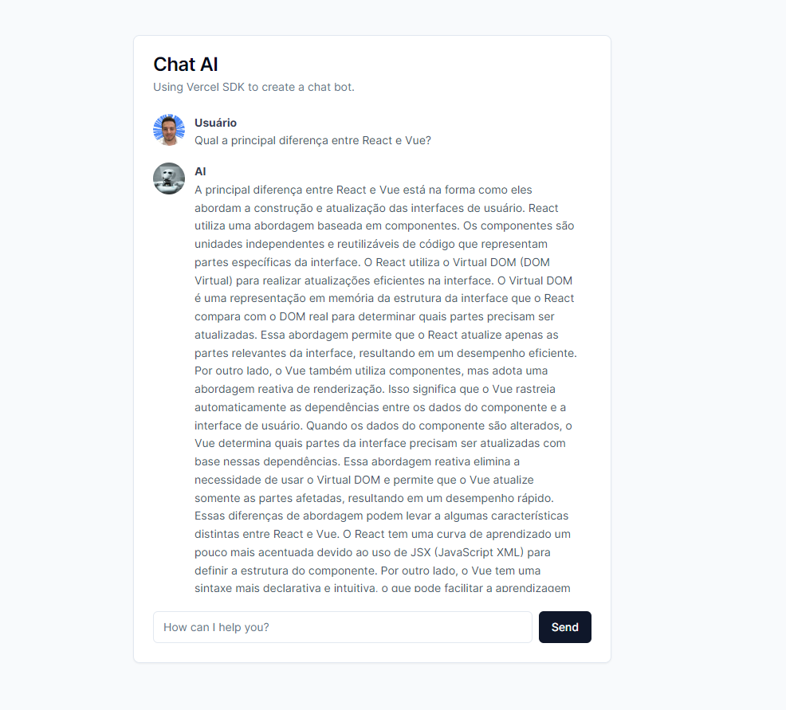

<h1 align="center">Chat AI</h1>

Projeto desenvolvido utilizando API da Open AI e o Vercel AI SDK.

  <a href="#-tecnologias">Tecnologias</a>&nbsp;&nbsp;&nbsp;|&nbsp;&nbsp;&nbsp;
  <a href="#-projeto">Projeto</a>&nbsp;&nbsp;&nbsp;|&nbsp;&nbsp;&nbsp;
  <a href="#memo-licença">Licença</a>&nbsp;&nbsp;&nbsp;|&nbsp;&nbsp;&nbsp;
  <a href="#-contato">Contato</a>

  

 

  

## 🚀 Tecnologias

Esse projeto foi desenvolvido com as seguintes tecnologias:

- **React**
- **Vercel AI SDK**
- **Open AI API**
- **Next.js**
- **shadcn/ui**

## 💻 Projeto

O ChatAI é um chatbot que utiliza da API da OpenAi para gerar respostas para a pergunta do usuário.
 

## :memo: Licença

Esse projeto está sob a [licença MIT](LICENSE).

## :email: Contato

## E-mail: [**marlonchiodelli@hotmail.com**](mailto:marlonchiodelli@hotmail.com)
